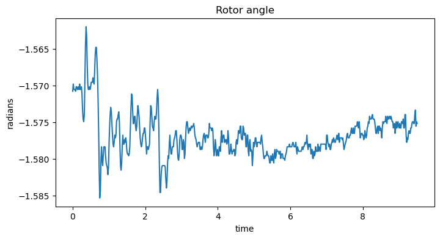
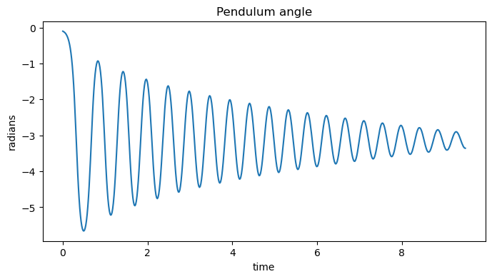
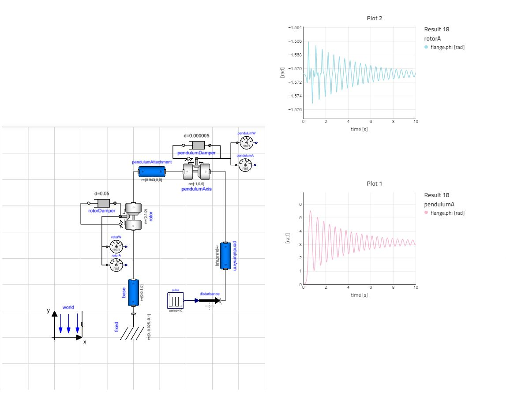
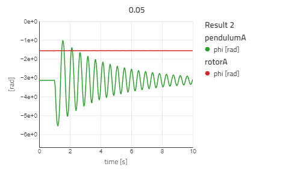
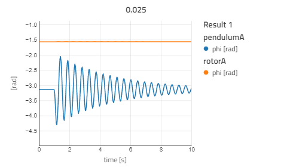
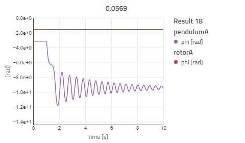

# Modeling and Simulation of Furuta Pendulum

This is a short report, written by Jacob Rinderud, for the lab "Modeling and Simulation of Furuta Pendulum" of the course FRTN65 Modeling and Learning from Data.

In this lab a [modelica model](./FurutaPendulum.mo) for a Furuta Pendulum was completed and extended to have an additional pendulum arm. More on that in the following chapters corresponding to the chapters in the [lab manual](./lab2manual.pdf).

## 1. Hands-on parameter tuning

    The dampening constants are not known and needs to be estimated in some manner. To do this, an experiment was done on the real Furuta pendulum were the pendulum was released from an almost upright position, and the angles of the rotor and pendulum bearings logged over time.





As seen in the figures above, the real pendulum has a dampening effect. Rotor dampening seems large in comparison to the pendulum dampening, the pendulums oscillations have a higher amplitude. The shape and amplitute of the rotor angle plot also suggests that it could be mostly noise.

### Task 1.1

The start angle was set to $0.01~rad$ and the resulting graphs from the simulation was compared to the graphs from the real pendulum. Below is a table of the tried dampening constants with $pendulumDamper = .000005, rotorDamper = .05$ being the final constants chosen, they resulted in a graph very similar to the real pendulum, and during the 3D-animation looked close to the real pendulum (which I personally have experience with from another course).

| pendulumDamper | rotorDamper | comment   |
|---             |---          |---        |
| 1              | 1           | too stiff |
| 0.1            | 0.1         | too stiff |
| 0.001          | 0.001       | falls great to start, too much air friction |
| 0.001          | 0.00001     | rotor moves a little to much |
| 0.0001         | 0.0001      | falls down too fast, abrupt stop at bottom |
| 0.01           | 0.015       | too stiff |
| 0.0001         | 0.1         | good, a little to fast to slow down |
| 0.00001        | 0.1         | good, a little to fast to slow down |
| 0.000005       | 0.1         | good pendulum, too stiff rotor |
| 0.000005       | 0.05        | very good, almost perfect |

Below is the image of the final dampening with model and graph next to eachother. As mentioned above, the graph looks very similar to the real pendulum with one thing noticable; the rotor plot looks way more tidy, consistant and "ideal". This is most likely due to the simulation not having noise in the way that reality does. Reinforsing my hunch that the real rotor plot was mostly noise.



The dampening constants also align with my previous note of the rotor dampening being larger than the pendulum dampening. This is probably, at least partially, due to the difference in mass between a small pendulum arm and a relatively large base rotor.

### Task 1.2

The start angle was set to $-\pi$ and a disturbance of {$0.05, 0.025, 0.0569$} noted by the name of the respective plot.




Above are the first two disturbances, and it is clear that a smaller disturbance force results in the pendulum swinging with smaller magnitude. As expected since we would expect the displacement to be proportional with the force applied.



The final plot above, is where I tried to do a manual swing-up (almost at least). Meaning that the pendulum just about stops at the top of the revolution.
This can be seen in the plot at ~1.7 s, where the pendulum is almost stationary for a fraction of a second before falling back down on the other side, seen in the plot from the |angle| being greater than $2\pi$.

## 2. Adding an additional pendulum arm

In this chapter a second pendulum arm is connected, this is done by extending the modelica model with a new set of components as specified in the [lab manual](./lab2manual.pdf) on page 4. This addition was easies done by using the diagram view and drag and dropping the components, I also colored the new components with green and red for easier differntiation and identification. This coloring proved wise then I was debugging the placement of the new arm.

.png)
.png)
.png)

Above are the plots for the same disturbances as before with the addition of the new pendulum appendage. The plots clearly show that the smaller pendulum is more damped, most likely due to the smaller mass carrying less momentum.

The maximum magnitude of the angle is also higher for the smaller pendulum in the first two plots, probably for the same reason. A smaller mass means the same force applied leads to a larger displacement. In the 0.0569 plot, the smaller pendulum looks like it is swinging one way and then swinging fast in the opposite direction, I am not sure how to explain this, it could be the movement of the other bodies in the system interacting to create a sort of yank.

## 3. Adding a damping controller

    The two pendulums are quite sensitive to external disturbances, which can introduce a lot of oscillation on the arm positions.

To mitigate some of this a state feedback controller is implemented to dampen these oscillations. A controller was added to the model as shown below. Connecting the state variable (the angles and the angular velocities) to the input of the controller and the output of the controller to a torque block, applying a torque on the rotor.

```mo
model ControllerLQR
    Modelica.Blocks.Interfaces.RealInput phi, dphi, theta1, dtheta1, theta2, dtheta2;
    Modelica.Blocks.Interfaces.RealOutput u(start=0);
    Real x[6];
    Real L[6] = {100., 9.65721819, 103.07438354, -1.40000991, 87.40106372, -3.88918398};
equation
    x = {phi+3.14/2, dphi, theta1+3.14, dtheta1, theta2+3.14, dtheta2};
    u = -L*x;
end ControllerLQR;

ControllerLQR c(
    phi = rotorA.phi, //rotor
    dphi = rotorW.w,   //rotor
    theta1 = pendulumA.phi, //pendulum
    dtheta1 = pendulumW.w,//pendulum
    theta2 = smallAngleSensor.phi, //small pendulum
    dtheta2 = smallSpeedSensor.w, //small pendulum
    u = torque.tau
);
```

Below are the same disturbance plots as in previous chapters but with the given LQR parameters. The plots clearly show that the controller is unstable as the angle steadily grow way beyond the expected values of around $\pm 4\pi$.


Unfortunately I didn't find good parameters to the controller and ran out of time testing. My thoughts are to weigh the angular velocities higher than the angles and to weight the input to be limited. In hopes of reducing over-compensation and jittery behaviour.
