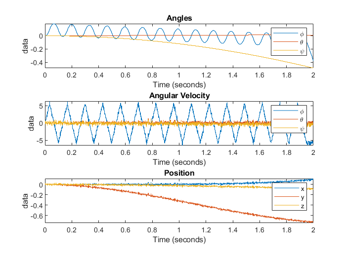
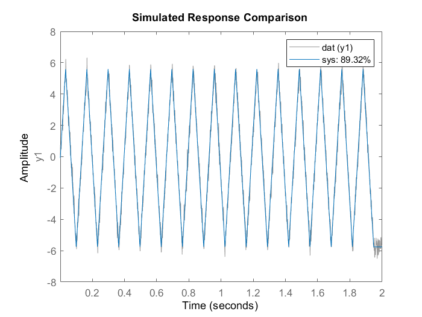

# Learning Quadcopter Flight Dynamics

We denote the position of the quadcopter with $x, y, z$ [m],
the orientation by $\phi, \theta, \psi$ [rad]
and the angular speed of the four rotors as
$\mathbf{\Omega}~=~[\Omega_1, \Omega_2, \Omega_3, \Omega_4]$ [rad/s].

## Task 1, estimating $k$

Estimating $k$ using $k_{est} = K_p * m$.
Which is derived from $m \ddot{z} = F = 4 \cdot k\Omega^2 - mg$
where $\Omega_i = \Omega$ for all rotors,
and by letting the $u~=~4\Omega^2$ we get $\zeta~=~\ddot{z}+g~=~\frac{k}{m} * u$
This gives an estimate on the form $\zeta~=~K_p u$
from which we can estimate $k$ as $k_{est}~=~K_p \cdot m$.
This results in code such as `k_est = sys2.Kp * m`.

Which results in $k_{est} = 2.2067e-08$, and the true $k = 2.2000e-08$.

This difference is $\approx 6.7e-11$ which is ~$0.3~\%$ of the true value. The estimation is very close to the real value and can be considered a good estimation.

## Task 2, estimating $I_3$ and $b$

By setting $\Omega_1 = \Omega_3$ and $\Omega_2 = \Omega_4$ the resulting torque profile will be that there is only a torque around the $z$-axis. That gives the equation of motion for the yaw angle as $\tau_{\psi} = I_3 \ddot{\psi} = b_i(-2\Omega_1^2 + 2\Omega_2^2)$.

Let $u=(-2\Omega_1^2 + 2\Omega_2^2)$ then the dynamics for $\dot{\psi}$ are given by $\frac{d}{dt}\dot{\psi} = \frac{b}{I_3}u$

To estimate $b$ and $I_3$, we make the quadcopter hover. This is done by letting $\Omega_2 = c\omega_1$ and setting $\omega_1$ from the quation $mg = k(2\omega_2^2+2\omega_1^2)$.
Combining these equations into $\Omega_1 = \sqrt{\frac{mg}{2k(c^2+1)}}$ and using this to set $c$ and the number of segments resulting in a hovering quadcopter, and the yaw angle $\psi$ in the range $\pm \pi$.

After some trial and error the values of $c=0.7$ and the number of segments $=12$ were found. Producing the following two graphs where we can read that the $z$ position barely changes.

<!-- TODO: insert fig 1 and fig 2>

-->

With these results, the $b$ and $I_3$ can be estimated.
Due to the proportional relation between them, $\frac{b}{I_3} = K_p$, only one of them can be estimated at a time,
meaning one of them have to be estimated in another way. It is therefore assumed that $I_3$ is estimated elsewhere/previously. Applying this to the code results in code as `b_est = Kp * I3`.

Which results in $b_{est} = 1.9969e-09$ and the true $b = 2.0000e-09$.

This difference is $\approx 3.1e-12$ which is ~$0.2~\%$ of the true value. The estimation is very close to the real value and can be considered a good estimation.

## Task 3, estimating $I_1$ and $I_2$

Due to the summetry of the quadcopter, it holds that $I_1=I_2$,
so we proceed estimating only one of them.
The equations of motion for the $\phi$ angle is given by
$\tau_{\phi} = I_1\ddot{\phi}$, where for small angles, the torque is given by
$\tau_{\phi} = kl(-\Omega_2^2 + \Omega_4^2)$.
If $\Omega_1~=~\Omega_3$ and $-\Omega_1^2~+~\Omega_2^2~-~\Omega_3^2~+~\Omega_4^2~=~0$ there will only be a torque on $\phi$.

Let $u=(-\Omega_2^2+\Omega_4^2)$, then $\dot{\phi}$ will satisfy $\dot{\phi} = \frac{kl}{I_2}\frac{1}{s}u$.

To estimate $I_1$ we find $\Omega_H$ where $\Omega_H = \Omega_i$ so that the quadcopter hovers. By rewriting $mg=k(2\Omega_1^2+2\Omega_2^2)$ using $\Omega_H$ we get
$\Omega_H = \sqrt{\frac{2\Omega_H^2}{4k}}$
With this, the quadcopter is hovering.
Adding a new constraint, $\Omega_4 = \Omega_2$, which implies that
$2\Omega_H = \Omega_2^2(1+c^2)$ must hold in order to keep the quadcopter hovering.

This can be made into $\Omega_2=\sqrt{\frac{2\Omega_H^2}{1+c^2}}$,
which is a function of $c$.
Finding a value of $c$ and the number of segments by satisfying that the $\phi$ angle stays small. Using $c = 0.6$ and the number of segments $= 30$ produces the two figures below.

<!-- TODO: insert fig 3 fig 4>

<-->

Using the equations introduces in this task, $I_{est}=\frac{kl}{K_p}$
results in $I_{est}=1.6667e-05$ with the true $I = 1.6600e-05$.

This difference is $\approx 6.7e-08$ which is ~$0.4 \%$ of the true value.
The estimation is very close to the real value and can be considered a good estimation.
